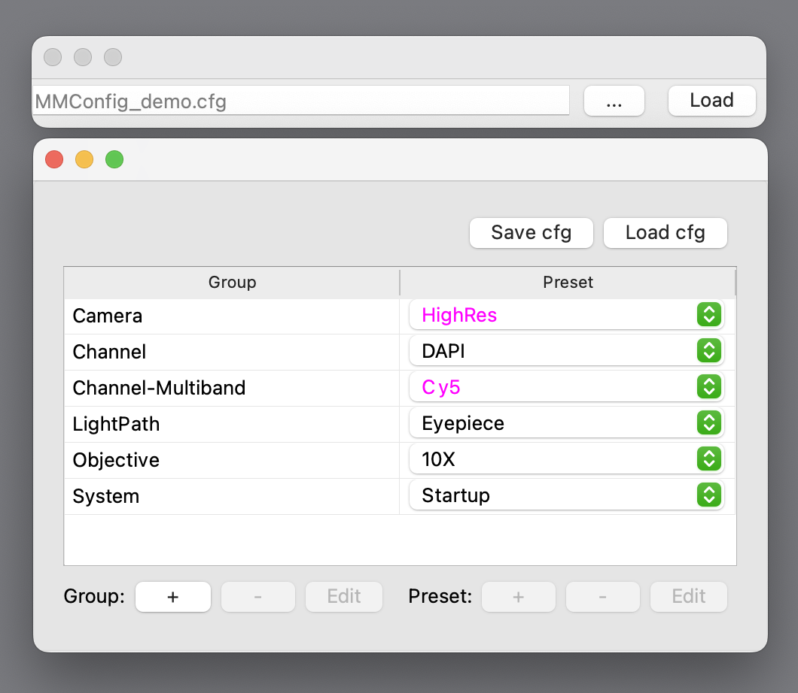

# Getting Started

## Installation

### Installing pymmcore-widgets

You can install the latest release of [pymmcore-widgets](https://pypi.org/project/pymmcore-widgets/) using pip:

```sh
pip install pymmcore-widgets
```

### Installing PyQt or PySide

Since [pymmcore-widgets](./index.md) relies on either the [PyQt](https://riverbankcomputing.com/software/pyqt/) or [PySide](https://www.qt.io/qt-for-python) libraries, you also **need** to install one of these packages. You can use any of the available versions of these libraries: [PyQt5](https://pypi.org/project/PyQt5/), [PyQt6](https://pypi.org/project/PyQt6/), [PySide2](https://pypi.org/project/PySide2/) or [PySide6](https://pypi.org/project/PySide6/). For example, to install [PyQt6](https://riverbankcomputing.com/software/pyqt/download), you can use:

```sh
pip install PyQt6
```

!!! Note
    Widgets are tested on:

    * `macOS & Windows`
    * `Python 3.8, 3.9 3.10 & 3.11`
    * `PyQt5 & PyQt6`
    * `PySide2 & PySide6`

### Installing Micro-Manager

The installation of the `pymmcore-widgets` package automatically includes [pymmcore-plus](https://pymmcore-plus.github.io/pymmcore-plus), as it is a key dependency for `pymmcore-widgets`. However, you still need to install the `Micro-Manager` device adapters and C++ core provided by [mmCoreAndDevices](https://github.com/micro-manager/mmCoreAndDevices#mmcoreanddevices). This can be done by following the steps described in the `pymmcore-plus` [documentation page](https://pymmcore-plus.github.io/pymmcore-plus/install/#installing-micro-manager-device-adapters).

## Usage

For a deeper understanding of each widget's functionality, refer to their [individual documentation](./widgets/CameraRoiWidget.md/) pages, where we provide short examples of usage.

### Basic usage

As shown in the example from the [Overview](./index.md#usage) section, for a basic usage of any of the widgets we need to:

1. create a Qt Application.
2. create a Micro-Manager [core](https://pymmcore-plus.github.io/pymmcore-plus/api/cmmcoreplus/#pymmcore_plus.core._mmcore_plus.CMMCorePlus.instance) instance so that all the widgets will control the same core.
3. load a configuration file.
4. create and show the wanted widget(s).

In this example, we substitute step 3 with the [ConfigurationWidget](./widgets/ConfigurationWidget/) widget which enables us to load any `Micro-Manager` configuration file. Additionally, we use the [GroupPresetTableWidget](./widgets/GroupPresetTableWidget/) widget, which provides an interactive interface for the `groups` and `presets` stored in the configuration file.

```python
# import the necessary packages
from qtpy.QtWidgets import QApplication
from pymmcore_plus import CMMCorePlus
from pymmcore_widgets import ConfigurationWidget, GroupPresetTableWidget

# create a QApplication
app = QApplication([])

# create a CMMCorePlus instance.
mmc = CMMCorePlus.instance()

# create a ConfigurationWidget
cfg_widget = ConfigurationWidget()

# create a GroupPresetTableWidget
gp_widget = GroupPresetTableWidget()

# show the created widgets
cfg_widget.show()
gp_widget.show()

app.exec_()
```

The code above will create a Qt Application with the `ConfigurationWidget` and `GroupPresetTableWidget`:



!!! Note
    Most widgets, by default, utilize the active core or instantiate a new one if none is currently active. This eliminates the need for manual core instance creation.

    For example, in the case above, the `ConfigurationWidget` is the first widget to be instantiated and will automatically create a new core instance. This makes the `mmc = CMMCorePlus.instance()` line redundant and removable.
    
    However, if a specific core instance is required, you can create a core instance first and then pass it as the `mmcore` argument to the widget (if available, not all the widgets have it), like so: `GroupPresetTableWidget(mmcore=my_core)`.

You can add to this simple code any other widgets from this package to control and interact with the same [Micro-Manager core instance](https://pymmcore-plus.github.io/pymmcore-plus/api/cmmcoreplus/#pymmcore_plus.core._mmcore_plus.CMMCorePlus.instance).

### Custom GUI

Building a custom GUI with the widgets provided by this package requires a more in-depth understanding of the Qt environment, such as [PyQt6](https://pypi.org/project/PyQt6/)..

In the following example, we construct a [QWidget](https://doc.qt.io/qt-6/qwidget.html) that incorporates several `pymmcore-widgets`: [ConfigurationWidget](./widgets/ConfigurationWidget/), [ChannelGroupWidget](./widgets/ChannelGroupWidget/), [ChannelWidget](./widgets/ChannelWidget/), [DefaultCameraExposureWidget](./widgets/DefaultCameraExposureWidget/), [ImagePreview](./widgets/ImagePreview/), [SnapButton](./widgets/SnapButton/), and [LiveButton](./widgets/LiveButton/).

This simple GUI enables you to load a `Micro-Manager` configuration file, snap an image or live stream images from the camera, with the flexibility to select a channel and adjust the exposure time.

```python
# Import the necessary packages
from qtpy.QtWidgets import QGridLayout, QWidget
from pymmcore_plus import CMMCorePlus
from pymmcore_widgets import (
    ChannelGroupWidget,
    ChannelWidget,
    ConfigurationWidget,
    DefaultCameraExposureWidget,
    ImagePreview,
    LiveButton,
    SnapButton,
)


# Create a QWidget class named MyWidget
class MyWidget(QWidget):
    """An example QWidget that uses some of the widgets in pymmcore_widgets."""

    def __init__(self, parent: QWidget | None = None):
        super().__init__(parent=parent)

        # This is not strictly necessary but we can create a Micro-Manager core
        # nstance so that all the widgets can control the same core. If you don't
        # create a core instance, the first widget to be instantiated will create
        # a new core instance.
        core = CMMCorePlus.instance()

        # Create the wanted pymmcore_widgets
        cfg = ConfigurationWidget()
        ch_group_combo = ChannelGroupWidget()
        ch_combo = ChannelWidget()
        exp = DefaultCameraExposureWidget()
        preview = ImagePreview()
        snap = SnapButton()
        live = LiveButton()

        # Create the layout for MyWidget
        # In Qt, a `layout` (https://doc.qt.io/qt-6/layout.html) is used to add
        # widgets to a `QWidget`. For this example, we'll employ a
        # `QGridLayout` (https://doc.qt.io/qt-6/qgridlayout.html) to organize the 
        # widgets in a grid-like arrangement.
        layout = QGridLayout(self)

        # Add the wanted pymmcore_widgets to the layout.
        # The first two arguments of 'addWidget' specify the grid position
        # in terms of rows and columns. The third and fourth arguments
        # define the span of the # widget across multiple rows and columns.
        layout.addWidget(cfg, 0, 0, 1, 3)
        layout.addWidget(ch_group_combo, 1, 0)
        layout.addWidget(ch_combo, 1, 1)
        layout.addWidget(exp, 1, 2)
        layout.addWidget(preview, 2, 0, 1, 3)
        layout.addWidget(snap, 3, 1)
        layout.addWidget(live, 3, 2)


# Create a QApplication and show MyWidget
if __name__ == "__main__":
    from qtpy.QtWidgets import QApplication

    app = QApplication([])
    widget = MyWidget()
    widget.show()
    app.exec_()
```

The code above will create a Qt Application that looks like this:


For a pre-made user interface, see [napari-micromanager](https://pypi.org/project/napari-micromanager/) ([github](https://github.com/pymmcore-plus/napari-micromanager)).
