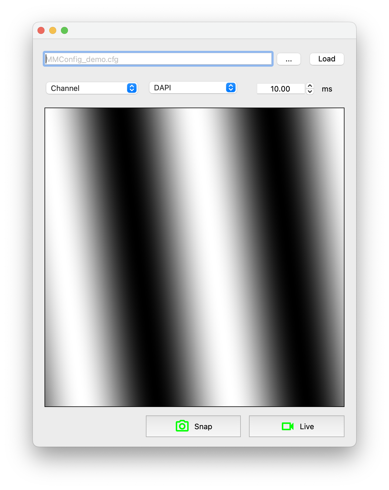

```python
# import the necessary packages
from qtpy.QtWidgets import QGridLayout, QWidget
from pymmcore_widgets import (
    ChannelGroupWidget,
    ChannelWidget,
    ConfigurationWidget,
    DefaultCameraExposureWidget,
    ImagePreview,
    LiveButton,
    SnapButton,
)


class MyWidget(QWidget):
    """An example QWidget that uses some of the widgets in pymmcore_widgets."""

    def __init__(self, parent: QWidget | None = None):
        super().__init__(parent=parent)

        # create the wanted pymmcore_widgets
        cfg = ConfigurationWidget()
        ch_group_combo = ChannelGroupWidget()
        ch_combo = ChannelWidget()
        exp = DefaultCameraExposureWidget()
        preview = ImagePreview()
        snap = SnapButton()
        live = LiveButton()

        # set the MyWidget layout
        layout = QGridLayout(self)

        # add the wanted pymmcore_widgets to the layout
        layout.addWidget(cfg, 0, 0, 1, 3)
        layout.addWidget(ch_group_combo, 1, 0)
        layout.addWidget(ch_combo, 1, 1)
        layout.addWidget(exp, 1, 2)
        layout.addWidget(preview, 2, 0, 1, 3)
        layout.addWidget(snap, 3, 1)
        layout.addWidget(live, 3, 2)


# create a QApplication and show MyWidget
if __name__ == "__main__":
    from qtpy.QtWidgets import QApplication

    app = QApplication([])
    widget = MyWidget()
    widget.show()
    app.exec_()
```

The code above will create a Qt application that looks like this:
