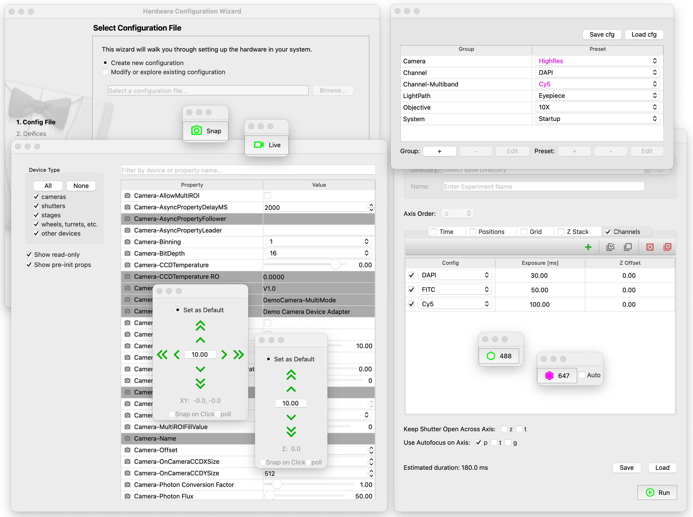

# Overview

[pymmcore-widgets](https://pypi.org/project/pymmcore-widgets/)
([github](https://github.com/pymmcore-plus/pymmcore-widgets)) is a library of
[PyQt](https://riverbankcomputing.com/software/pyqt/)/[PySide](https://www.qt.io/qt-for-python)
widgets that can be used in combination with
[pymmcore-plus](https://pymmcore-plus.github.io/pymmcore-plus)
([github](https://github.com/pymmcore-plus/pymmcore-plus)) to create custom GUIs (Graphical User
Interfaces) for the [Micro-Manager](https://micro-manager.org) in a pure python/C++ environment.



## Installation

```sh
pip install pymmcore-widgets
```

!!! Important
    This package does **NOT** include a [PyQt](https://riverbankcomputing.com/software/pyqt/)/[PySide](https://www.qt.io/qt-for-python) backend, you must install one yourself (e.g. ```pip install PyQt6```).

    It also **requires** the `Micro-Manager` device adapters and C++ core provided by [mmCoreAndDevices](https://github.com/micro-manager/mmCoreAndDevices#mmcoreanddevices).

For a more detailed description on how to install the package, see the [Getting Started](getting_started.md#installation) section.

## Usage

As a quick example, let's create a simple Qt Application that:

- creates a [Micro-Manager core instance](https://pymmcore-plus.github.io/pymmcore-plus/api/cmmcoreplus/#pymmcore_plus.core._mmcore_plus.CMMCorePlus.instance) so that all the widgets can control the same core.

- loads the default `Micro-Manager` system configuration.

- creates and shows a [PropertyBrowser](widgets/PropertyBrowser.md) widget. You can use this widget to view and modify the properties of any of the loaded devices.

```py
# import the necessary packages
from qtpy.QtWidgets import QApplication
from pymmcore_plus import CMMCorePlus
from pymmcore_widgets import PropertyBrowser

# create a QApplication
app = QApplication([])

# create a CMMCorePlus instance
mmc = CMMCorePlus.instance()

# load the default Micro-Manager system configuration. To load a specific 
# configuration, provide the "path/to/config.cfg" file as an argument.
mmc.loadSystemConfiguration()

# create a PropertyBrowser widget. By default, this widget will use the active
# Micro-Manager core instance.
pb_widget = PropertyBrowser()

# show the created widget
pb_widget.show()

app.exec_()
```

The code above will create a Qt Application that looks like this:


A more detailed description on how to use the `pymmcore-widgets` package is explained in the [Getting Started](getting_started.md#usage) section.

For a pre-made user interface, see [napari-micromanager](https://pypi.org/project/napari-micromanager/) ([github](https://github.com/pymmcore-plus/napari-micromanager)).

## Widgets List

Below there is a list of all the widgets available in this package **grouped by their functionality**.

For a more detailed information on each widget, explore their [individual documentation](./widgets/CameraRoiWidget/).

### Cameras Widgets

The widgets in this section can be used to **control** any `Micro-Manager` device of type [CameraDevice](https://pymmcore-plus.github.io/pymmcore-plus/api/constants/#pymmcore_plus.core._constants.DeviceType.CameraDevice).

{{ CAMERA_WIDGETS }}

### Configurations Widgets

The widgets in this section can be used to **create, load and modify a Micro-Manager configuration** file.

{{ CONFIGURATION_WIDGETS }}

### Devices and Properties Widgets

The widgets in this section can be used to **control and intract with the devices and properties** of a `Micro-Manager` core ([CMMCorePlus](https://pymmcore-plus.github.io/pymmcore-plus/api/cmmcoreplus/#cmmcoreplus)).

{{ DEVICE_PROPERTY_WIDGETS }}

### Multi-Dimensional Acquisition Widgets

The widgets in this section can be used to **define (and run) a multi-dimensional acquisition** based on the [useq-schema MDASequence](https://pymmcore-plus.github.io/useq-schema/schema/sequence/#useq.MDASequence).

{{ MDA_WIDGETS }}

### Shutters Widgets

The widgets in this section can be used to **control** any `Micro-Manager` device of type [ShutterDevice](https://pymmcore-plus.github.io/pymmcore-plus/api/constants/#pymmcore_plus.core._constants.DeviceType.ShutterDevice).

{{ SHUTTER_WIDGETS }}

### Stages Widgets

The widgets in this section can be used to **control** any `Micro-Manager` device of type [StageDevice](https://pymmcore-plus.github.io/pymmcore-plus/api/constants/#pymmcore_plus.core._constants.DeviceType.StageDevice).

{{ STAGE_WIDGETS }}

### Misc Widgets

The widgets in this section are **miscellaneous** widgets that can be used for different purposes. See their [individual documentation](./widgets/ChannelGroupWidget/) for more details.

{{ MISC_WIDGETS }}
